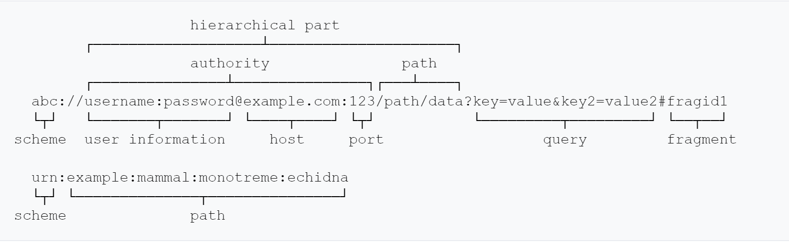

## OSI 概念模型
dfdfd
- 应用层
  - 解决业务问题，有 DNS、HTTP、P2P、Email 等协议
- 表示层
  - 负责把网络中的消息转换成应用层可以读取的消息
- 会话层
  - 建立会话，维持连接，关闭连接，这一层是一个概念
- 传输层
  - 进程与进程之间的通信，有 TCP、UDP、TLS-SSL、SCTP 等协议
  - 网络数据到了主机上，由传输层决定分发给哪个进程（端口）
- 网络层
  - IP 、ARP 等协议
- 数据链路层
  - MAC 地址，可以通过 MAC 地址转发报文
- 物理层

### TCP/IP 模型

- 应用层
- 传输层
- 网络层
- 物理层

## 对 URI 进行编码

`Uniform Resource Identified` 资源统一标识符

- 需要保留分隔字符，有些浏览器会对分隔符做特殊处理
  - https://www.baidu.com/s?wd=?#!  #号后面会被认为时 fragment，被截断掉
  - https://www.baidu.com/s?wd=极客 时间  空格会被浏览器编码
  - https://www.baidu.com/s?wd=极客>时间
- 对可能产生歧义性的数据编码
  - 不在 ASCII 中的字符
  - ASCII 不可显示的字符
  - URI 中规定的保留字符（=、$、#、@等）
  - 不安全字符（传输过程中可能会被不正确处理），比如空格、引号等

### 编码方式

- 百分号编码
- 非 ASCII 码字符（如中文），建议先用 UTF8，再 US-ASCII 编码
- 对于 URI 合法字符，编码与编码时等价的

## 常见请求方法

- GET：获取资源
- POST：提交资源
- HEAD：类似 GET 方法，不发送 BODY，用以获取 HEAD 元数据
- PUT：更新资源
- DELETE：删除资源
- CONNECT：建立 tunnel 隧道
- OPTIONS：显示服务器对资源访问的方法

## 响应码

### 1xx

**1xx** 表示请求已经到达，需要进一步处理才能完成
- **100 Continue**：上传大文件使用
  - 由客户端发起请求中携带 Expect: 100-continue 头部触发
- **101 Switch Protocol**：协议升级使用
  - 由客户端发起请求中携带 Upgrade 头部触发，如升级 WebSocket 或 HTTP 2.0
- **102 Processing**：服务器已经收到并且正在处理，但无响应可用，这样防止客户端超时

### 2xx

**2xx**表示成功处理请求
- **200 OK**：成功返回响应
- **201 Created**：有新资源在服务器被成功创建
- **202 Accepted**：服务器接收并开始处理请求，但请求并未完成。例如异步请求、需要长时间处理的任务
- **203 Non-Authoritative Information**：当代理服务器修改了源服务器的原响应包体时，代理服务器可以通过修改 200 为 203的方式告知客户端，方便客户端为这一行为做进一步处理。203 响应可以被缓存
- **204 No Content**：成功执行了请求且不携带响应包体，并暗示客户端无需更新当前页面
- **205 Reset Content**：成功执行了请求且不携带响应包体，并指明客户端需更新当前页面
- **206 Partial Content**：使用 range 协议时返回部分响应内容
- **207 Multi-Status**：RFC4918，在 WEBDAV 协议中以 XML 返回多个资源的状态
- **208 Already Reported**：RFC5812，为了避免相同合集下资源在 207 响应码下重复上报，使用 208 可以使用父集合的响应码

### 3xx

**3xx**表示重定向使用 Location 指向的资源或者缓存中的资源。在 RFC2068 中规定客户端重定向次数不超过 5 次，以防止死循环。
- **300 Multiple Choices**：资源有多种描述，通过 300 返回给客户端后由其自由选择，这个很少使用
- **301 Moved Permanently**：资源永久性重定向到另一个 URI 中
- **302 Found**：资源临时重定向到另一个 URI 中
- **303 See Other**：重定向到其他资源，常用于 POST/PUT 等方法中
- **304 Not Modified**：当客户端拥有可能过期资源时，会携带缓存的标识符 etag、时间等信息询问服务器资源是否仍可复用，而304 是告诉客户端可以用使用
- **307 Temporary Redirect**：类似 302，但明确重定向后请求方法必须与原请求方向相同，不得改变
- **308 Permanent Redirect**：类似 301，但明确重定向后请求方法必须与原请求方向相同，不得改变

### 4xx

4xx 表示客户端出现错误
- **400 Bad Request**：服务器认为客户端出现了错误，但不能明确判断以下哪种错误时使用此错误代码。例如 HTTP 请求格式错误
- **401 Unauthorized**：用户认证信息缺失或者不正确，导致服务器无法处理请求
- **407 Proxy Authentication Required**：对需要经由代理的请求，认证信息未通过代理服务器的认证
- **403 Forbidden**：服务器理解请求的含义，但没有权限执行此请求
- **404 Not Found**：服务器没有找到对应的资源
- **410 Gone**：服务器没有找到对应的资源，且明确知道该位置永久性找不到该资源
- **405 Mehtod Not Allowed**：服务器不支持请求行中的 method 方法
- **406 Not Acceptable**：对客户端指定资源描述不存在（例如对语言或者编码由要求），服务器返回表述列表供客户端选择
- **408 Request Timeout**：服务器接收请求超时
- **409 Conflict**：资源冲突，例如上传文件时目标位置已经存在版本更新的资源
- **411 Length Required**：如果请求包含包体且未携带 Content-Length 头部，且不属于 chunk 类型，返回 411
- **412 Precondition Failed**：复用缓存时传递的 If-Unmodified-Since 或 If-None—Match 头部不被满足
- **413 Payload Too Large/ Request Entity Too Large**：请求的包体超出服务器能处理的最大长度
- **414 URI too Long**：请求的 URI 超过服务器能接受的最大长度
- **415 Unsupported Media Type**：上传的文件类型不被服务器支持
- **416 Range Not Satisfable**：无法提供 Range 请求中指定的那段包体
- **417 Exceptation Failed**：对于 Except 请求头部期待的情况无法满足的响应码
- **421 MisDirected Request**：服务器认为这个请求不该发给它，因为它没能力处理
- **426 Upgrade Required**：服务器拒绝基于当前 HTTP 协议提供服务，通过 Upgrade 头部告知客户端必须升级协议才能继续处理
- **428 Precondition Required**：用户请求中缺失了条件类头部，例如 If-Match
- **429 Too Many Request**：客户端发送请求的速率过快
- **431 Request Header Fields Too Large**：请求的 HEADER 头部大小超过限制
- **451 Unavailable For Legal Reasons**：由于法律原因资源不可访问

### 5xx

5xx 表示服务器出现错误
- **500 Internal Server Error**：服务器内部错误，且不属于以下错误类型
- **501 Not Implemented**：服务器不支持实现请求所需要的功能
- **502 Bad Gateway**：代理服务器无法获取合法响应（像源服务器）
- **503 Service Unavailable**：服务器资源尚未准备好处理当前请求
- **504 GateWay Timeout**：代理服务器无法及时的从上游服务器获的响应
- **505 HTTP Version Not Support**：请求使用的 HTTP 协议版本不支持
- **507 Insufficient Storage**：服务器没有足够空间处理请求
- **508 Loop Detected**：访问资源时检测到循环
- **511 Network Authoritarian Required**：代理服务器发现客户端需要进行身份验证时才能获取网络访问权限 

## Cookie、Set-Cookie

## Seesion

## 缓存

## 重定向

## 爬虫的工作原理和应对方式

## HTML form 表单提交时的协议格式

