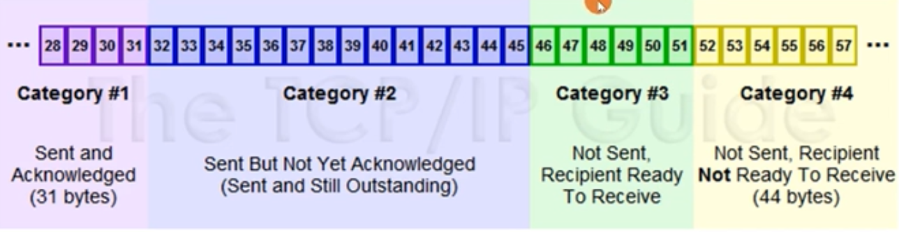
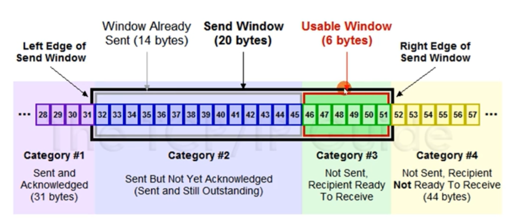
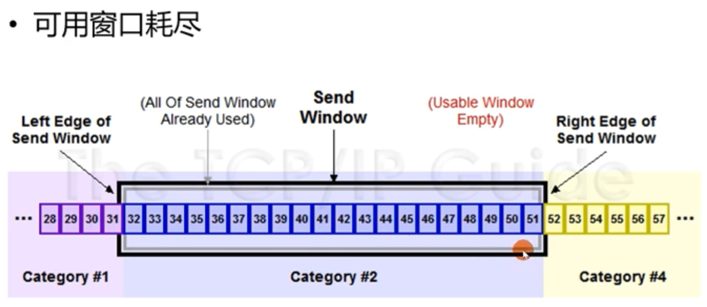
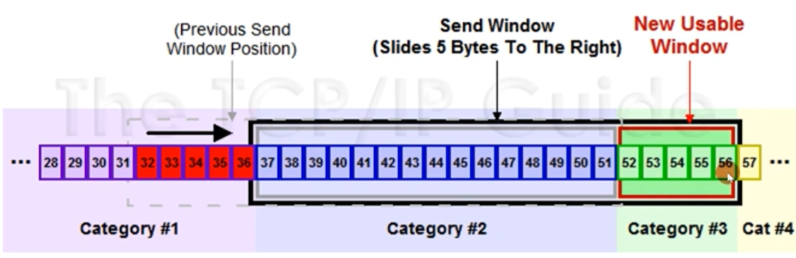
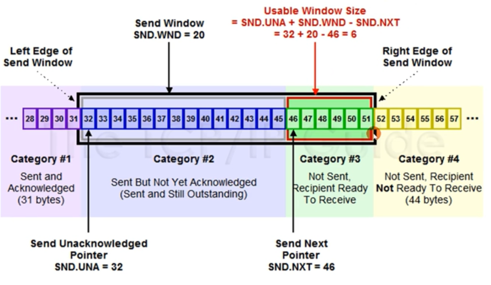
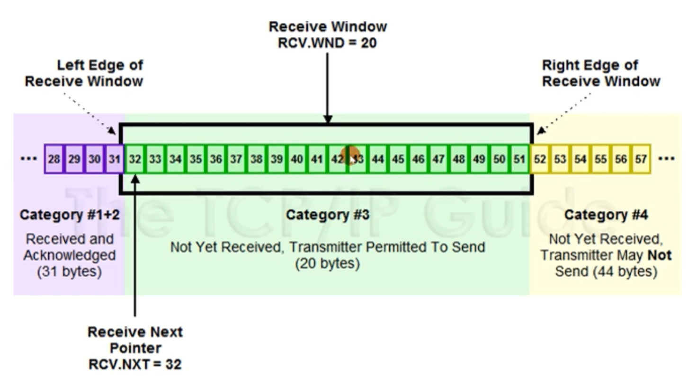
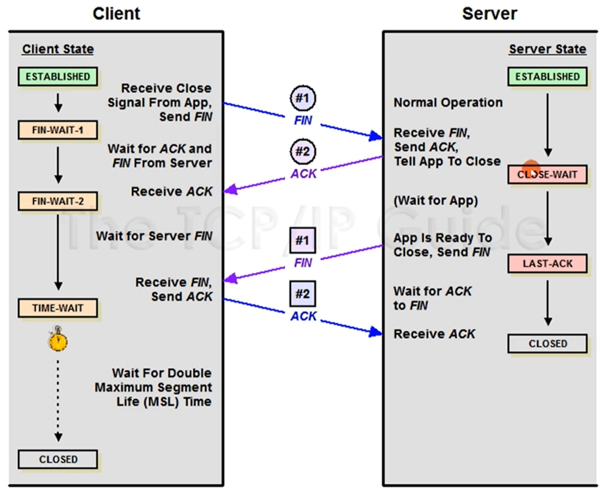

## TCP 特点
- 在 IP 协议之上，解决网络通讯可依赖问题
  - 点对点（不能广播、多播），面向连接
  - 双向传递（全双工，比如 WebSocket）
  - 字节流：打包成报文段、保证有序接收、重复报文自动丢弃
    - 缺点：不维护应用报文的边界（对比 HTTP、GRPC），需要手动设置 Content-length
    - 优点：不强制要求应用必须离散的创建数据块，不限制数据块大小
  - 流量缓冲：解决速度不匹配问题
  - 可靠的传输服务（保证可达，丢包时通过重发进而增加时延实现可靠性
  - 拥塞控制

## 三次握手

握手目标：
- 同步 Sequence 序列号
  - 初始化序列号 ISN（Initial Sequence Number），动态生成的
- 交换 TCP 通讯参数
  - 如 MSS、窗口比例因子、选择性确认、指定校验和算法

握手流程：
1. 一开始，客户端和服务端都是 CLOSED 状态
2. 服务端主动监听某个端口，处理 LISTEN 状态
3. 客户端主动发起一个 SYN 状态的报文，客户端初始化序列号 ISN 比如是 seq=x，之后处于 SYN-SENT 状态
4. 服务端收到客户端的 SYN 报文，也会初始化序列号 ISN seq=y，同时会把把客户端序列号改为 ack=x+1，服务端返回 SYN + ACK 报文给客户端，之后处于 SYN-RCVD 状态
5. 客服端收到 SYN 和 ACK 报文之后，确认 ACK 后，把服务端接受来的序号改为 ack=y+1，发送 ACK 报文给服务端，之后处于 ESTABLISHED 状态
6. 服务端收到 ACK 后，状态也变为 ESTABLISHED
7. 客户端和服务端成功握手，这过程需要两个 RTT 时间

MSS：Max Segment Size
- 定义：仅指 TCP 每一段报文承载的最大数据，不包含 TCP 头部的大小
- MSS 选择目的
  - 尽量每个 Segement 报文段携带更多的数据，以减少头部空间占用比率
  - 防止 Segement 被某个设备的 IP 层基于 MTU 拆分，这样效率会降低
- 默认 MSS：536 字节（默认 MTU 576 字节，20 字节 IP 头部，20 字节 TCP 头部）
- 握手阶段协商 MSS
- MSS 分类
  - 发送方最大报文段 SMSS：Sender Max Segement Size
  - 接收方最大报文段 RMSS：Receiver Max Segement Size

## 重发

- 发送端可以并发地发送消息（顺序时由字节序列号（Sequence Number）来区分），等待接收端发回确认，如果过一段时间没得到确认，客户端会重发该序列字节（发送端有个定时器，超过设定时间也会重发，这个时间不是固定的，会根据网络好坏动态设置长短）
- TCP 序列号可能会导致重复，可以通过 Timestamps 时间戳来区分

## 发送窗口和接收端口

窗口大小（Window Size Value）：表示目前能处理字节大小，是操作系统分配的。发送窗口和接收窗口理论上是一样的，引入拥塞窗口后，发送窗口等于接收窗口和拥塞窗口其中最小值。

发送窗口：
- 已发送并收到 ACK 确认的数据：1-31字节
- 已发送未收到 ACK 确认的数据：32-45字节，第一个字节位置为 UNA
- 未发送但总大小在接收方处理范围内：46-51字节，第一个字节位置 NXT
- 未发送但总大小超出接收方处理范围内：52-字节

发送窗口：

可用窗口/发送窗口：

可用窗口耗尽：

发送窗口移动：

发送窗口:

接收窗口：

窗口变小：
- 接收端会根据自身接收情况（是否及时处理接收缓存，缓存占用窗口大小），更改窗口大小，再把窗口大小发送给发送端，发送端也会更改窗口大小，做出调整。当接收端窗口大小为 0 时候，接收端告诉发送端窗口大小为 0，发送端就会暂停发送，发送端会定期询问接收端窗口大小，等待接收端的窗口变大时，而是会等窗口到了一定大小再让发送端发送。

## 拥塞控制

- 慢启动
- 拥塞避免
- 快速重传
- 快速恢复

慢启动：
- 拥塞窗口 cwnd（congestion window）
  - 通告窗口 rwnd（receiver's advertised window）
  - 发送窗口 swnd = min(cwnd, rwnd)
- 每收到一个 ACK，cwnd 就扩展一倍（根据没有发生丢包）
- 初始窗口 IW（initial window）为 10 MSS

拥塞避免：
- 慢启动阈值 ssthresh（slow start threhold）
  - 达到 ssthresh 后，以线性方式增加 cwnd，不再以指数级增长
  - 如果发生了丢包，ssthresh 重新设置为原先的一半，拥塞窗口降为低位置

快速重传：
- 接收方：
  - 当接收到一个失序数据时，立刻发送它所期待的缺口 ACK 序列号
  - 当接收到填充失序数据段时，立刻发送它所期待的下一个 ACK 序列号
- 发送方：
  - 当接收到 3 个重复的失序 ACK 段（4个相同失序 ACK 段）时，不在等待定时器的触发，立刻基于快速重传机制重发丢失的报文段
- 超时不会启动快速重传

快速恢复：
- 收到重复的 ACK，意味着网络仍然在流动，没有必要慢启动
- 启动快速重传且正常未失序的 ACK 段到达前，启动快速恢复

##  关闭连接

1. 刚开始服务端和客户端都处于 ESTABLISHED 状态。客户端想断开连接，发送 FIN 报文，之后进入 FIN_WAIT_1 状态，服务端收到消息，会回 ACK 报文给客户端，服务端之后进入 CLOSE_WAIT 状态
2. 客户端收到服务端消息 ACK 后，进入 FIN_WAIT_2 状态。这时候如果 B 直接断开，A 会一直保持这个状态
3. 服务端等待一段时间后状态由 CLOSE_WAIT 改为 LAST_ACK。服务端开始发送 FIN 给客户端
4. 客户端会回复一个 ACK 报文给服务端，客户端没有直接关闭，而是会处于等待一段时间 TIME_WAIT 状态，服务端收到 ACK 后把状态改成 CLOSE，客户端等待 2MSL（Maximum Segment Lifetime 报文最大生存时间）最大时间后也会把状态改为 CLOSE